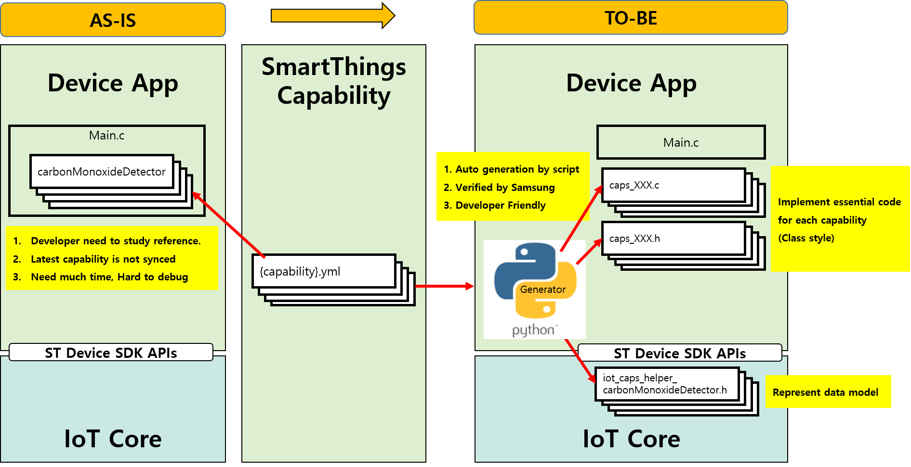

# Capability Helper Guide

Capability helper is introduced to alleviate the inconvenience of developers and shorten development time. By using Auto-generator(python script), Samsung create 3 files for each capability and check basic functionality with generic plugin. Then it is included and released as part of SmartThings Device SDK through GitHub.



1. iot_caps_helper_{capability}.h  
iot_caps_helper_{capability}.h is in the iot-core. It represent data model described in yaml file. By using this, developer don’t need to find proper string, value range and so on.

2. caps_{capability}.c / caps_{capability}.h  
caps_{capability}.c/h is in the reference app. Essential functions are already implemented in this file. So developer just need to add board specific codes to control their HW. For developer who want to manage their code in the main file, callbacks(for initialization and command) are also provided optionally.

## Details

### iot_caps_helper_{CAPABILITY}.h
- exist in iot_core(IOT_CORE/src/include/caps/)
- explain schema of capability as C style
- define strings required for capability operation
    - example: ID of capability, name of attribute, string enum value.

### caps_{CAPABILITY}.h, caps_{CAPABILITY}.c
- exist in app path
- function and variable for attribute and command of capability.
- initialize caps_data by using caps_{CAPABILITY}_initialize
- set/get attribute value by using set_{ATTRIBUTE}_value / get_{ATTRIBUTE_VALUE}
- send attribute value by using attr_{ATTRIBUTE}_send
- when command comes , set attribute value and call cmd_{COMMAND}_usr_cb, and send attrivute value.
    - exceptionally, command has no related attribute or command has too many arguments is not supported.

## How to use capability helper

- initialize & register callback function
    - initialize caps_data and set init callback by using caps_{CAPABILITY}_initialize
    - set command callback. 
```c
cap_switch_data = caps_switch_initialize(ctx, "main", cap_switch_init_cb, NULL);
cap_switch_data->cmd_on_usr_cb = cap_switch_cmd_cb;
cap_switch_data->cmd_off_usr_cb = cap_switch_cmd_cb;
```

- init callback function
    - set init value for capability in init callback
    - after callback function call, attribute values will be sent to server.
 ```c
 static void cap_colorControl_init_cb(struct caps_colorControl_data *caps_data) {
    caps_data->set_color_value(caps_data, 0, 100);
}
 ```

- command callback function
    - before callback function call, attribute values was setted in normal case.
    - get attribute value by using get_{ATTRIBUTE}_value and do action.
    - after callback function call, attribute value will be sent to server.
```c
static void cap_switchLevel_cmd_cb(struct caps_switchLevel_data *caps_data){
    int value = caps_data->get_level_value(caps_data);
    control_switch_level(value);
}
```
- send attribute value
    - set attribute value by using set_{ATTRIBUTE}_value
    - send attribute value by using attr_{ATTRIBUTE}_send
```c
cap_threeAxis_data->set_threeAxis_value(cap_threeAxis_data, x, y, z);
cap_threeAxis_data->attr_threeAxis_send(cap_threeAxis_data);
```